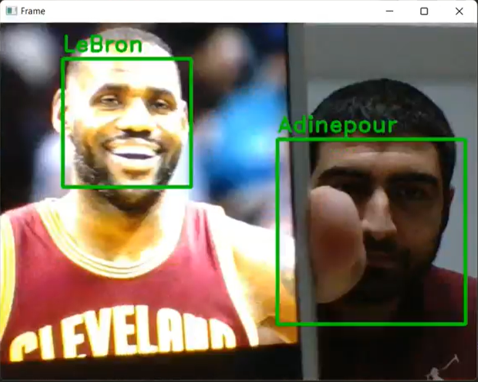

# Real Time Face Recognition
In this project i used [face_recognition](https://github.com/ageitgey/face_recognition/tree/master) library

## Installation
To install Face Recognition, run this command in your terminal:
```
$ pip3 install face_recognition
```
This is the preferred method to install Face Recognition, as it will always install the most recent stable release.

If you don't have [pip](https://pip.pypa.io/en/stable/) installed, this [Python installation guide](https://docs.python-guide.org/starting/installation/) can guide you through the process.

For more detail, read [here](https://github.com/ageitgey/face_recognition/blob/master/docs/installation.rst)

## Dataset
Place a photo of each person in <code>C:\\Users\\[pcName]\\Desktop\\images\\</code>path below. The name of each person should be placed on the file name.

## Run
For start real-time face recognition, run <code>main_video.py</code> on your ide.

## Result
This is the result of code for two person


